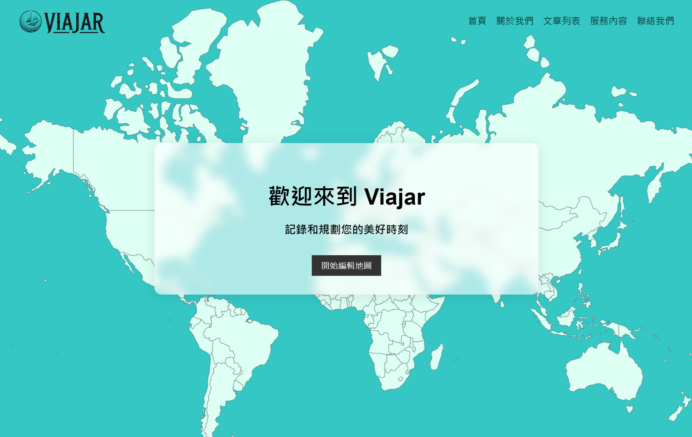
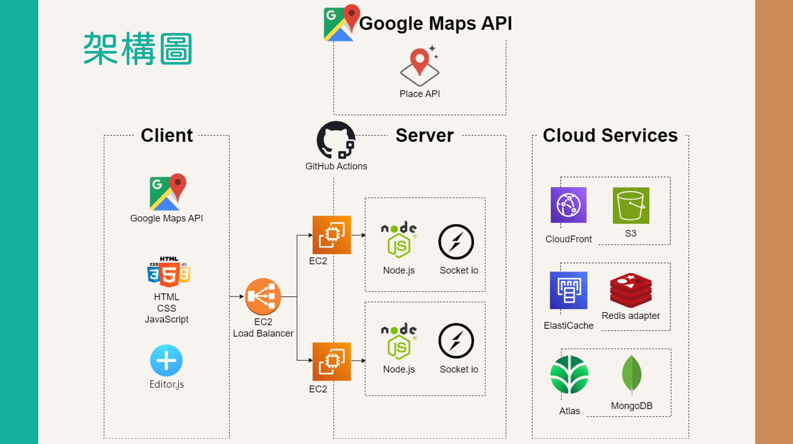

<div style="display:flex; justify-content:start;">
    
    
</div>
<br/>

Viajar 是一個利用圖形化方式，讓使用者記錄旅遊經歷和規劃旅遊行程的網站。  
<br/>



網站連結：<https://viajar.alexespitia.com/landingPage.html>

## 功能

測試帳號密碼
```
帳號： test@example.com
密碼： testtesttest
```
</br>

測試的 Google 帳號密碼
```
帳號： viajar.alexespitia@gmail.com
密碼： testforviajar
```

如需測試同步功能，可使用無痕同時 Google 和 Native 登入，由 Native 登入向測試的 Google 帳號的 Gmail 發出地圖邀請，即可測試同步功能。
</br>
</br>

- **共同編輯地圖**：使用 Socket.IO 讓使用者可以同步游標、獲取地圖控制權、同步地標建立。  
- **地圖邀請與權限設定**：使用 Gmail 發送地圖邀請，並設定地圖權限避免使用者互相更改地圖資訊。  
- **負載分流與資料同步**：使用 EC2 Load Balancer 分流使用者，並通過 ElastiCache 和 Redis adapter 同步不同 EC2 的資料。  
- **Google 登入與JWT驗證**：支援 Google 註冊和登入，並利用 JWT 維持登入狀態。  
- **後端架構**：後端使用 Node.js 和 Express ，建立 MVC 架構，符合 RESTful API ，並使用 GitHub Actions 進行自動化部屬。  
- **資料存儲**：使用 Atlas 的雲端 MongoDB 儲存資料，圖片檔案藉由 CloudFront 儲存在 S3。  
- **地點資料管理**：從 Google Maps API 的 Places API 取得地點資料並儲存到資料庫，以節省API成本並提升用戶體驗。實施資料過期策略以確保資料的正確性和即時性。  
- **前端功能**：前端使用 Google Maps API 讓使用者在地圖上建立地標，使用 Editor.js 打造豐富多功能的部落格頁面，並使用 Places API 讓使用者搜尋地點和尋找附近的餐廳。 

## 技術與工具

###Front-End : <br>
- HTML
- CSS
- JavaScript<br>
###Back-End : <br>
- Node.js
- Express
- JWT
- MVC
- CRUD
- RESTful API<br>
###Cloud services : <br>
- EC2
- Load Balancer
- ElastiCache
- Atlas MongoDB
- CloudFront
- S3
- Route 53<br>
###Other tools : <br>
- Git
- GitHub
- GitHub Actions
- Google Maps API
- Socket.IO
- Editor.js
- PM2
- Redis adapter<br>

## 架構圖


## 聯絡資訊
Alex Chi<br>
sss88154@gmail.com
